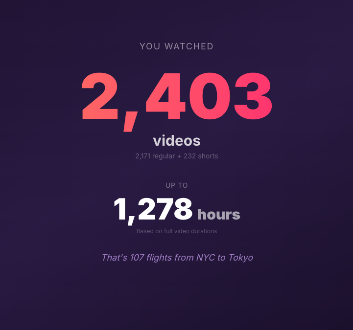
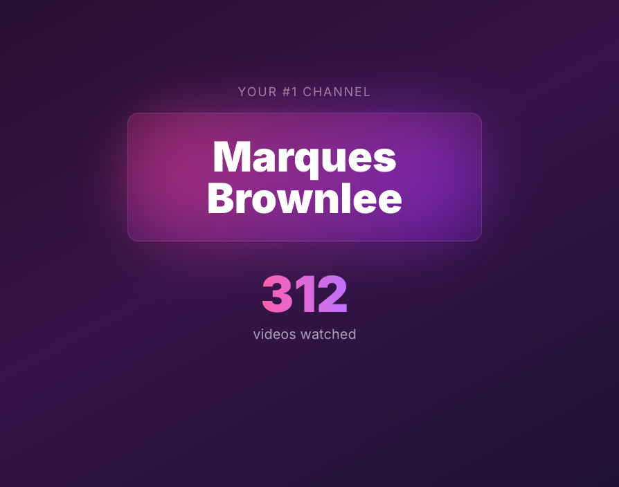
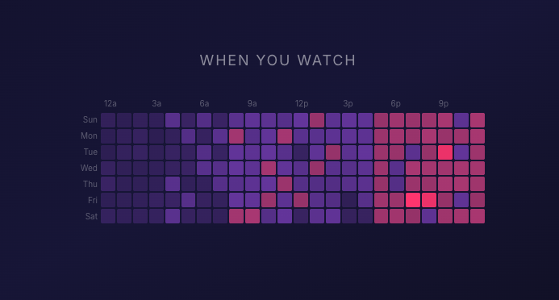
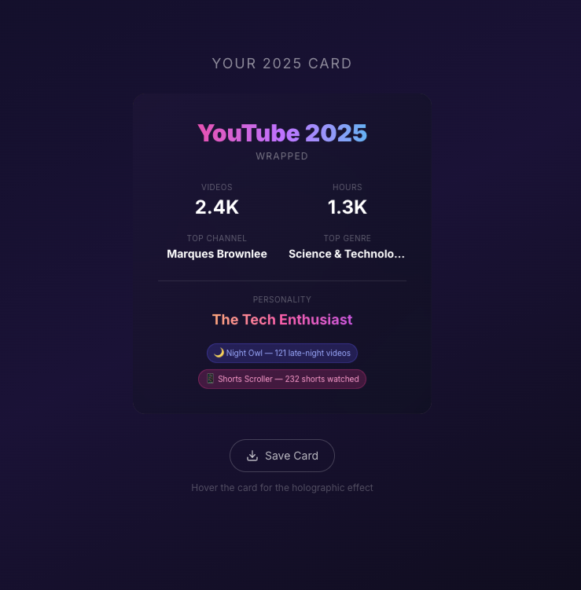

# YouTube Wrapped

Your YouTube year in review — Spotify Wrapped style.

Upload your Google Takeout watch history, and get a beautiful, animated breakdown of your viewing habits: total watch time, top channels, category breakdowns, viewing heatmaps, and a holographic summary card you can save and share.


## Screenshots

<p align="center">
  
  
  
</p>

<p align="center">
  
</p>

## Features

- **12 animated slides** — swipe through your year like Spotify Wrapped
- **Total watch time** — videos watched, hours spent, with fun comparisons
- **Top channels & categories** — ranked with animated charts
- **Watching heatmap** — when you watch, hour by hour, day by day
- **Monthly trends** — how your watching evolved over the year
- **Late night stats** — your midnight-to-4am habits exposed
- **Most rewatched videos** — the ones you kept coming back to
- **YouTube Shorts analysis** — your short-form video stats
- **Holographic summary card** — a Pok&eacute;mon-card-style holo effect you can save as an image
- **Demo mode** — try it out with sample data, no upload needed
- **Mobile support** — gyroscope-driven holo tilt on mobile devices

## Getting Started

### Prerequisites

- Node.js 18+
- A YouTube Data API v3 key ([get one here](https://console.cloud.google.com/apis/library/youtube.googleapis.com))

### Setup

```bash
git clone https://github.com/your-username/yt-wrapped.git
cd yt-wrapped
npm install
```

Create a `.env.local` file with your API key:

```
YOUTUBE_API_KEY=your_api_key_here
```

Then start the dev server:

```bash
npm run dev
```

Open [http://localhost:3000](http://localhost:3000) and upload your watch history — or click **Try Demo** to explore with sample data.

### Getting Your Watch History

1. Go to [Google Takeout](https://takeout.google.com/)
2. Deselect all, then select **YouTube and YouTube Music**
3. Under YouTube, click **All YouTube data included** and select only **history**
4. Choose **JSON** as the format
5. Export and download
6. Find `watch-history.json` in the archive and upload it

## Tech Stack

- **Next.js 16** (App Router) + **TypeScript**
- **Tailwind CSS** + **Framer Motion** for styling and animations
- **Recharts** for data visualizations
- **Zustand** for state management
- **YouTube Data API v3** for video metadata enrichment

## How It Works

1. **Parse** — extracts video IDs, titles, channels, and timestamps from the Takeout JSON
2. **Enrich** — batches video IDs (50/request) to the YouTube API for durations, categories, and stats
3. **Analyze** — computes all stats: watch time, top channels, heatmaps, binge sessions, and more
4. **Display** — presents everything as a series of full-screen animated slides

Enriched data is cached in localStorage (7-day TTL) to avoid redundant API calls on repeat visits.

## License

MIT
